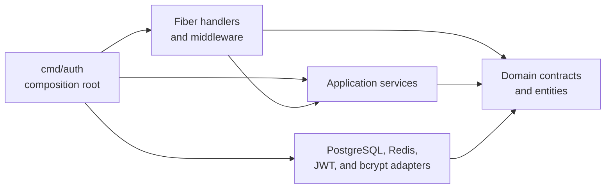

# Architecture

The project uses a pragmatic ports-and-adapters structure. The core defines application behavior and contracts; infrastructure and HTTP packages implement or consume those contracts.

## Package responsibilities

| Package | Responsibility |
| --- | --- |
| `cmd/auth` | Composition root, process lifecycle, startup, and graceful shutdown |
| `internal/domain/entity` | Core data structures |
| `internal/domain/repository` | Persistence contracts used by the application and transport |
| `internal/domain/service` | Stateless domain-service contracts for JWT and CSRF operations |
| `internal/domain/apperror` | Errors whose meaning is independent of HTTP and storage providers |
| `internal/application/dto` | Application input and output structures |
| `internal/application/service` | User registration, authentication, OAuth identity resolution, session issuance, and lookup behavior |
| `internal/infrastructure` | PostgreSQL, Redis, authentication security, configuration, and logging adapters |
| `internal/infrastructure/auth` | bcrypt password handling, JWT issuance and validation, and CSRF protection |
| `internal/interface/transport/http` | Fiber routes, handlers, cookies, and HTTP error mapping |
| `internal/interface/middleware` | Request validation, authentication, tracing, and request logging |

## Dependency direction

The application and domain packages do not import Fiber, PostgreSQL, Redis, or transport-specific errors. Dependencies point inward through small interfaces:



`cmd/auth` is the only composition root. It validates configuration, opens PostgreSQL, applies pending versioned migrations, optionally loads seed data, opens Redis, constructs adapters and services, injects them into HTTP handlers, starts Fiber, and closes resources during shutdown.

## Request flow

A typical authenticated request follows this path:

1. Fiber middleware assigns request and correlation IDs.
2. Authentication middleware extracts and validates the access JWT.
3. Redis confirms that the token family and access-token ID are still active and resolves the user ID.
4. Middleware confirms the Redis user matches the signed claim and stores a typed, UUID-only request identity.
5. A handler loads the complete user through the application service only when the endpoint needs profile data.
6. The handler produces an HTTP response.

Caller contexts flow from Fiber through application services into PostgreSQL and Redis operations, allowing cancellation and deadlines to propagate.

## Error handling

Application and infrastructure code return ordinary Go errors. Expected conditions such as invalid credentials, a duplicate email, or an inactive session use errors from `internal/domain/apperror`.

The HTTP response adapter maps those errors to status codes and safe client messages. Unexpected infrastructure details are logged and returned as a generic `500` response rather than exposed to clients.

## Testing strategy

- Application-service tests use repository and password-service stubs.
- HTTP and middleware tests use Fiber's in-memory test server.
- Protected-route tests verify invalid Redis sessions are rejected before any user-repository lookup.
- JWT, bcrypt, configuration, and logging have package-level tests.
- OAuth tests cover typed provider profiles, invalid profiles, returning users, identity conflicts, rollback, and session issuance without contacting Google.
- Registration, login, refresh, replay, concurrent refresh, CSRF, and logout integration cases run against real PostgreSQL and Redis services, assert expected HTTP status codes, verify that authentication responses do not expose tokens, and produce response and coverage reports.
- PostgreSQL integration tests cover expected adapter errors, cancellation, deadlines, duplicate-registration concurrency, query plans, schema constraints, migrations, and transactional provider-identity rollback.

The standard verification commands are:

```sh
go test ./...
go test -race ./...
go vet ./...
```

Set `POSTGRES_TEST_DSN` to a disposable PostgreSQL database when running the PostgreSQL adapter integration tests. The tests create and remove isolated schemas within that database.

## PostgreSQL query contract

Repository integration tests verify that the schema supports the actual lookup paths:

| Repository operation | Constraint or index |
| --- | --- |
| Find or deduplicate a user by email | `users_email_key` |
| Resolve a user by UUID | `users_user_uuid_key` |
| Resolve an external identity by provider and subject | `provider_identities_provider_subject_unique` |
| Find identities for a user, including provider-link checks and deletion cascades | `provider_identities_user_uuid_idx` |
| Enforce at most one identity per provider and user | `provider_identities_provider_user_unique` |

User UUIDs are non-null because session and provider-identity code treat them as stable identifiers. Provider names and subjects cannot be blank. The separate provider-identity `user_uuid` index is intentional: the `(provider, user_uuid)` unique index cannot efficiently serve a `user_uuid`-only foreign-key cascade.

The pool currently exposes only its maximum connection count. Connection establishment has a bounded ping, and every repository method propagates request cancellation and deadlines. Additional minimum-size, idle-time, lifetime, and health-check controls were not added because this repository has no measured deployment behavior requiring non-default values. Those controls should be introduced with database proxy, stale-connection, or load evidence and corresponding operational tests.

## Deployment note

Development and test processes may apply embedded migrations during startup. Production defaults to a dedicated one-shot migration command that must succeed before application replicas start. The migration command requires only PostgreSQL configuration, uses the same immutable release image as the application, and returns a failure status for configuration, connection, checksum, or SQL errors. PostgreSQL advisory locking serializes concurrent jobs, and the migration transaction rolls back on failure. See the [deployment guide](./deployment.md) for Compose and orchestrator examples.

PostgreSQL-backed integration tests cover clean migration, repeated and concurrent execution, legacy-schema adoption, checksum drift, failed-transaction rollback, and provider-identity transactions when `POSTGRES_TEST_DSN` is configured.

## Current architectural limitations

- The HTTP API is handwritten; no OpenAPI contract is generated or validated.

These limitations form the technical review backlog. Each item should be evaluated and either addressed or explicitly accepted before this starter is treated as production-ready.
